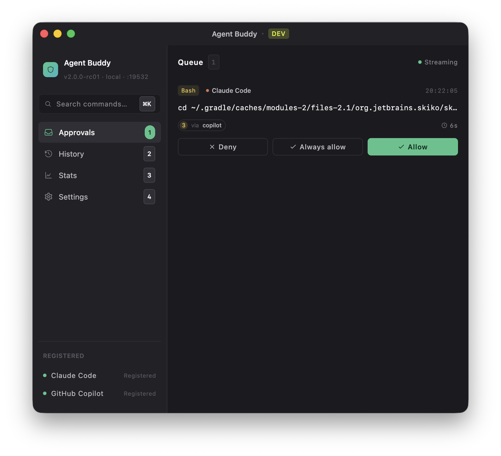
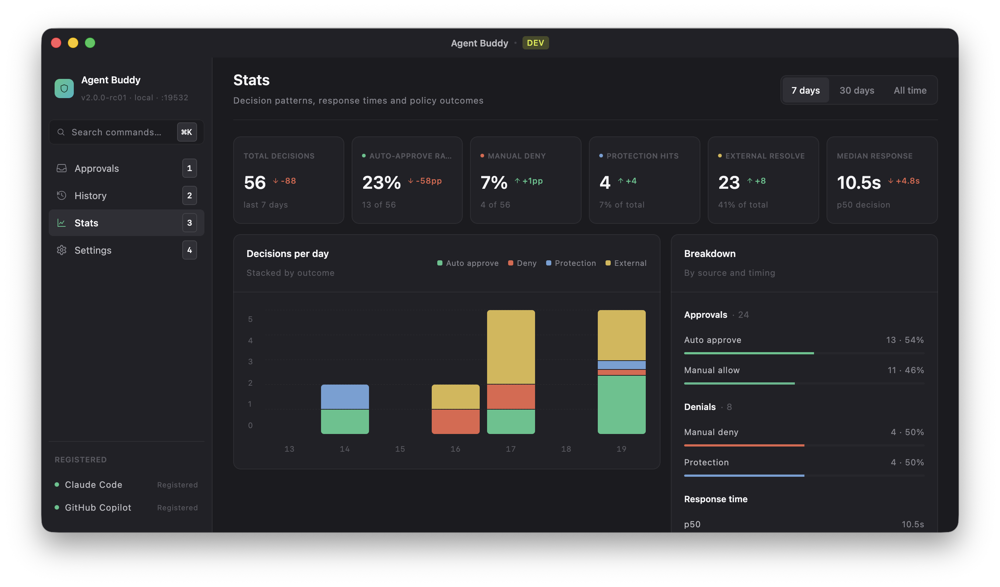
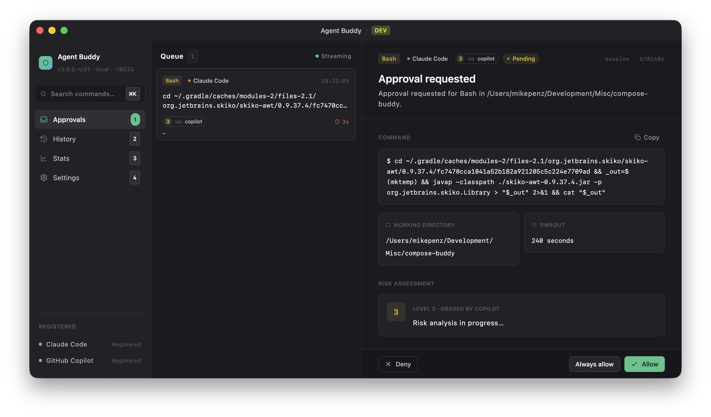
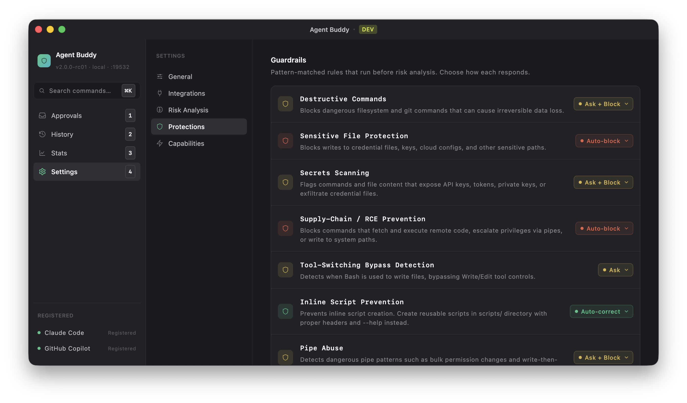
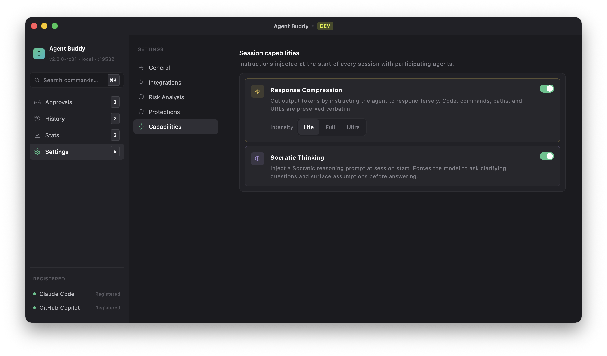

<p align="center">
  
</p>

<h1 align="center">Agent Buddy</h1>

<p align="center">
  A desktop application that gives you full control over what AI coding agents can do on your machine.
</p>

<p align="center">
  <a href="https://github.com/mikepenz/agent-buddy/actions/workflows/ci.yml"></a>
  <a href="https://github.com/mikepenz/agent-buddy/blob/main/LICENSE"></a>
</p>

---

Agent Buddy is a **human-in-the-loop gateway** for AI coding agents like [Claude Code](https://docs.anthropic.com/en/docs/claude-code) and [GitHub Copilot](https://github.com/features/copilot). It intercepts tool requests (file edits, shell commands, web fetches, etc.) via hook events, displays them in a review UI, and lets you approve or deny each action before it executes.

<p align="center">
  
  &nbsp;&nbsp;
  
  &nbsp;&nbsp;
  
</p>

### Key Features

- **Approval UI** — Review pending tool requests with syntax-highlighted diffs, command previews, and context
- **Protection Engine** — Built-in rules that block dangerous operations (destructive commands, credential access, supply-chain attacks)
- **Risk Analysis** — Optional AI-powered risk scoring (1-5) via Claude CLI or GitHub Copilot to auto-approve safe operations
- **Always Allow** — Grant persistent permissions for trusted tool patterns
- **Away Mode** — Disable timeouts for remote/async approval workflows
- **History** — Searchable log of all past approval decisions
- **System Tray** — Runs in the background with badge notifications for pending approvals
- **Cross-Platform** — macOS, Windows, and Linux (currently only macOS pre-built packages are provided)

## Quick Start

### 1. Install

Download the latest macOS DMG from [Releases](https://github.com/mikepenz/agent-buddy/releases), or build from source for any platform:

```bash
git clone https://github.com/mikepenz/agent-buddy.git
cd agent-buddy
./gradlew :composeApp:run    # requires JDK 17+
```

> **macOS note:** The release DMG is currently **unsigned**. On first launch, macOS will block it. Go to **System Settings > Privacy & Security** and click **Open Anyway** to allow it.

### 2. Connect Your Agent

Agent Buddy integrates via [hooks](https://docs.anthropic.com/en/docs/claude-code/hooks) — lightweight HTTP callbacks that AI agents fire before executing tools. The app registers two types of hooks:

| Hook | Purpose | Claude Code | GitHub Copilot |
|------|---------|:-----------:|:--------------:|
| **PreToolUse** | Runs the Protection Engine to block or modify dangerous requests _before_ the agent acts | Supported | Supported |
| **PermissionRequest** | Presents the request in the Approval UI for interactive human review | Supported | Supported¹ |

¹ Requires GitHub Copilot CLI **v1.0.16 or later** (added the `permissionRequest` hook event) and **v0.0.422 or later** for user-scoped hook loading from `~/.copilot/hooks/`.

Both Claude Code and GitHub Copilot now support the full interactive approval flow plus `PreToolUse` Protection Engine pre-checks.

**Claude Code** — In Settings > Integrations, click **Register Hooks** to add both hook entries to `~/.claude/settings.json`.

**GitHub Copilot** — In Settings > Integrations, click **Register** under GitHub Copilot. This installs the bridge scripts under `~/.agent-buddy/` and writes both hook entries (`permissionRequest` + `preToolUse`) into a single user-scoped `~/.copilot/hooks/agent-buddy.json` — no per-project setup needed.

### 3. Review & Approve

When Claude Code requests permission to use a tool:

1. The request hits Agent Buddy's local HTTP server
2. The **Protection Engine** evaluates it against built-in safety rules — dangerous requests are blocked or modified automatically
3. If the request passes, it appears in the **Approvals** tab for your review
4. You approve or deny — the response is sent back to the agent
5. All decisions are logged in the searchable **History** tab

## Protection Engine

Built-in modules detect and block dangerous patterns, inspired in part by [claude-hooks](https://github.com/jspanos/claude-hooks):

| Module | Examples |
|--------|----------|
| Destructive Commands | `rm -rf`, `git reset --hard`, force push |
| Credential & Supply-Chain Protection | `.env` files, SSH keys, `curl \| bash`, base64 decode + exec |
| Tool Bypass Prevention | `sed -i`, `perl -pi`, echo redirects bypassing Edit tool |
| Environment Safety | Bare `pip install`, absolute paths, uncommitted file edits |

Each module can be configured to: **Auto Block**, **Ask** (prompt user), **Auto-correct**, **Log Only**, or **Disabled**.

## Risk Analysis

Agent Buddy can optionally score each request's risk level (1–5) using AI, allowing safe operations (risk 1) to be auto-approved and critical ones (risk 5) to be auto-denied.

Two backends are supported:
- **Claude** — Spawns a `claude` CLI process to analyze the request.
- **Copilot** — Uses the GitHub Copilot API for risk assessment.

> **macOS note (Claude backend):** Because risk analysis spawns a `claude` CLI process, macOS may show a file access permission dialog. This permission is **not required** — you can safely deny it. The risk analysis will still work correctly.

<p align="center">
  
</p>
<p align="center">
  
  &nbsp;&nbsp;
  
  &nbsp;&nbsp;
  
</p>

## Tech Stack

- **[Kotlin 2.3](https://kotlinlang.org/)** with Kotlin Multiplatform (JVM target)
- **[Compose Multiplatform](https://www.jetbrains.com/compose-multiplatform/)** for the desktop UI
- **[Ktor](https://ktor.io/)** for the embedded HTTP server that receives hook callbacks
- **[SQLite](https://www.sqlite.org/)** for persistent history storage
- **[Nucleus](https://github.com/niclas-4712/nucleus)** for native window decorations and macOS dock integration

## Design System

The UI is built on a small set of theme-aware primitives living under
`composeApp/src/jvmMain/kotlin/com/mikepenz/agentbuddy/ui/`:

- **Theme tokens** — `ui/theme/Theme.kt` exposes `AgentBuddyColors.*`
  (theme-aware semantic colors) and `AgentBuddyDimens.*` (canonical
  icon/density tokens).
- **Shared primitives** — `ui/components/` (`PillSegmented`,
  `AgentBuddyCard`, `StatusPill`, `RiskPill`, `ToolTag`, `SourceTag`,
  `DesignToggle`, `ScreenLoadingState`, `ScreenErrorState`, …).
- **Previews** — every composable has one or more `@Preview`
  functions covering the state matrix (empty / loading / full / error /
  hover / light+dark).

### Generating screenshots

Screenshots are rendered headlessly with
[compose-buddy-cli](https://github.com/mikepenz/compose-buddy) — the
same tool the iter 1–5 design passes used to verify every change. Build
the CLI once (`./gradlew :compose-buddy-cli:installDist` in the
compose-buddy repo) and point `COMPOSE_BUDDY_CLI` at the installed
binary, then:

```bash
export COMPOSE_BUDDY_CLI=/path/to/compose-buddy-cli/build/install/compose-buddy-cli/bin/compose-buddy-cli

# Render every @Preview as PNG (desktop renderer, headless)
$COMPOSE_BUDDY_CLI render \
  --project . --module :composeApp --renderer desktop \
  --output /tmp/agent-approver-previews \
  --build --format agent --hierarchy --semantics all

# Filter to a single surface while iterating
$COMPOSE_BUDDY_CLI render \
  --project . --module :composeApp --renderer desktop \
  --preview '*ApprovalCard*' --output /tmp/agent-approver-previews
```

Output goes to `<output>/manifest.json` plus one PNG per preview
(including `*_Light` / `*_Dark` multi-preview variants). The
`--hierarchy --semantics all` flags emit the semantic tree used for the
a11y audit. **Any UI change must re-render and be verified visually
before commit.**

See [`composeApp/DESIGN.md`](composeApp/DESIGN.md) for the full token
table, state-matrix coverage, and the preview-authoring playbook.

## Contributing

See [CONTRIBUTING.md](CONTRIBUTING.md) for development setup and guidelines.

## Acknowledgements

The Protection Engine modules are inspired in part by [claude-hooks](https://github.com/jspanos/claude-hooks) by [@jspanos](https://github.com/jspanos).

## License

Licensed under Apache 2.0. See [LICENSE](LICENSE) for details.
