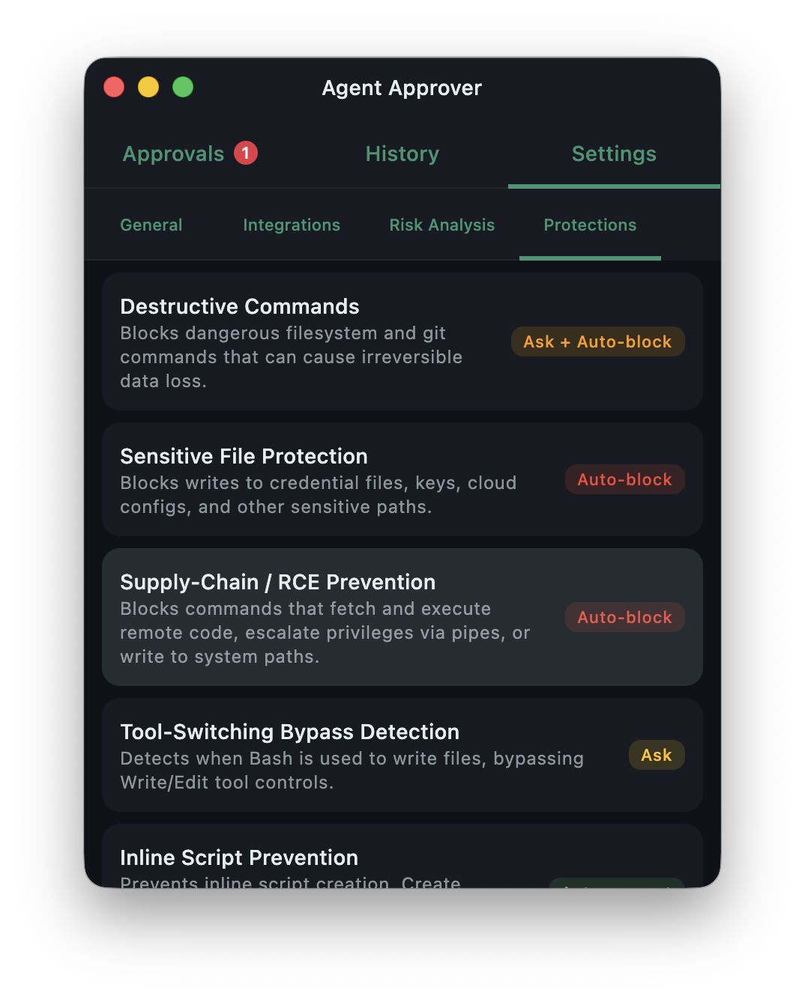

<p align="center">
  
</p>

<h1 align="center">Agent Approver</h1>

<p align="center">
  A desktop application that gives you full control over what AI coding agents can do on your machine.
</p>

<p align="center">
  <a href="https://github.com/mikepenz/agent-approver/actions/workflows/ci.yml"></a>
  <a href="https://github.com/mikepenz/agent-approver/blob/main/LICENSE"></a>
</p>

---

## What is Agent Approver?

Agent Approver acts as a **human-in-the-loop gateway** for AI coding agents like [Claude Code](https://docs.anthropic.com/en/docs/claude-code) and [GitHub Copilot](https://github.com/features/copilot). It intercepts tool requests (file edits, shell commands, web fetches, etc.) via hook events, displays them in a review UI, and lets you approve or deny each action before it executes.

### Key Features

- **Approval UI** — Review pending tool requests with syntax-highlighted diffs, command previews, and context
- **Protection Engine** — Built-in rules that automatically block dangerous operations (destructive commands, sensitive file access, supply-chain attacks, etc.)
- **Risk Analysis** — Optional AI-powered risk scoring (1-5) via Claude CLI or GitHub Copilot to auto-approve safe operations
- **Always Allow** — Grant persistent permissions for trusted tool patterns
- **Away Mode** — Disable timeouts for remote/async approval workflows
- **History** — Searchable log of all past approval decisions
- **System Tray** — Runs in the background with badge notifications for pending approvals
- **Cross-Platform** — macOS, Windows, and Linux with native packaging (DMG, MSI, DEB)

## Screenshots

<p align="center">
  
  &nbsp;&nbsp;
  
  &nbsp;&nbsp;
  
</p>
<p align="center">
  
  &nbsp;&nbsp;
  
  &nbsp;&nbsp;
  
</p>
<p align="center">
  
</p>

## Installation

### Download

Download the latest release for your platform from the [Releases](https://github.com/mikepenz/agent-approver/releases) page.

### Build from Source

```bash
git clone https://github.com/mikepenz/agent-approver.git
cd agent-approver
./gradlew :composeApp:run
```

**Requirements:** JDK 17+

To build native packages:

```bash
./gradlew packageDmg   # macOS
./gradlew packageMsi   # Windows
./gradlew packageDeb   # Linux
```

## Setup

### Claude Code Integration

Agent Approver registers itself as a [Claude Code hook](https://docs.anthropic.com/en/docs/claude-code/hooks). On first launch, click **Register Hooks** in the Settings tab to add the hook entries to `~/.claude/settings.json`.

This registers two hooks:
- **PermissionRequest** — Intercepts tool approval requests (`POST /approve`)
- **PreToolUse** — Runs protection engine checks before tool execution (`POST /pre-tool-use`)

### GitHub Copilot Integration

Copilot only supports the **PreToolUse** hook, which runs protection engine checks but does not support interactive approvals.

In the Settings > Integrations tab, use the **Copilot Bridge** installer to set up the hook script and configure your project's `.github/hooks/hooks.json`.

## How It Works

```
┌─────────────┐     HTTP POST     ┌──────────────────┐     UI Review     ┌──────┐
│  AI Agent    │ ───────────────▶  │  Agent Approver   │ ───────────────▶  │ User │
│ (Claude Code │     /approve      │  (Ktor Server)    │                   │      │
│  / Copilot)  │ ◀─────────────── │                    │ ◀─────────────── │      │
└─────────────┘   allow/deny JSON  └──────────────────┘  approve/deny     └──────┘
```

1. The AI agent sends a tool request to Agent Approver's local HTTP server
2. The **Protection Engine** evaluates the request against built-in safety rules
3. If the request passes protection checks, it appears in the **Approvals** tab
4. You review and approve/deny — the response is sent back to the agent
5. All decisions are logged in the **History** tab

## Protection Engine

The protection engine includes modules that detect and block dangerous patterns:

| Module | Description |
|--------|-------------|
| Destructive Commands | `rm -rf`, `git reset --hard`, force push, etc. |
| Sensitive Files | `.env`, SSH keys, cloud credentials, etc. |
| Supply Chain / RCE | `curl \| bash`, base64 decode + exec, etc. |
| Tool Bypass | `sed -i`, `perl -pi`, echo redirects that bypass Edit tool |
| Inline Scripts | Heredoc scripts, complex `bash -c` invocations |
| Pipe Abuse | Bulk `chmod`/`chown` via xargs, write-then-execute |
| Piped Tail/Head | Piping to `tail`/`head` instead of using temp files |
| Python Venv | Bare `pip install` without virtual environment |
| Absolute Paths | Absolute paths that should be project-relative |
| Uncommitted Files | Edits to files with uncommitted changes |

Each module can be configured to: **Auto Block**, **Ask** (prompt user), **Log Only**, or **Disabled**.

## Tech Stack

- **Kotlin 2.3** with Kotlin Multiplatform (JVM target)
- **Compose Multiplatform** for the UI
- **Ktor** for the embedded HTTP server
- **SQLite** for persistent history storage
- **Nucleus** for native window decorations and macOS integration

## Contributing

See [CONTRIBUTING.md](CONTRIBUTING.md) for development setup and guidelines.

## License

```
Copyright 2026 Mike Penz

Licensed under the Apache License, Version 2.0 (the "License");
you may not use this file except in compliance with the License.
You may obtain a copy of the License at

    http://www.apache.org/licenses/LICENSE-2.0

Unless required by applicable law or agreed to in writing, software
distributed under the License is distributed on an "AS IS" BASIS,
WITHOUT WARRANTIES OR CONDITIONS OF ANY KIND, either express or implied.
See the License for the specific language governing permissions and
limitations under the License.
```
